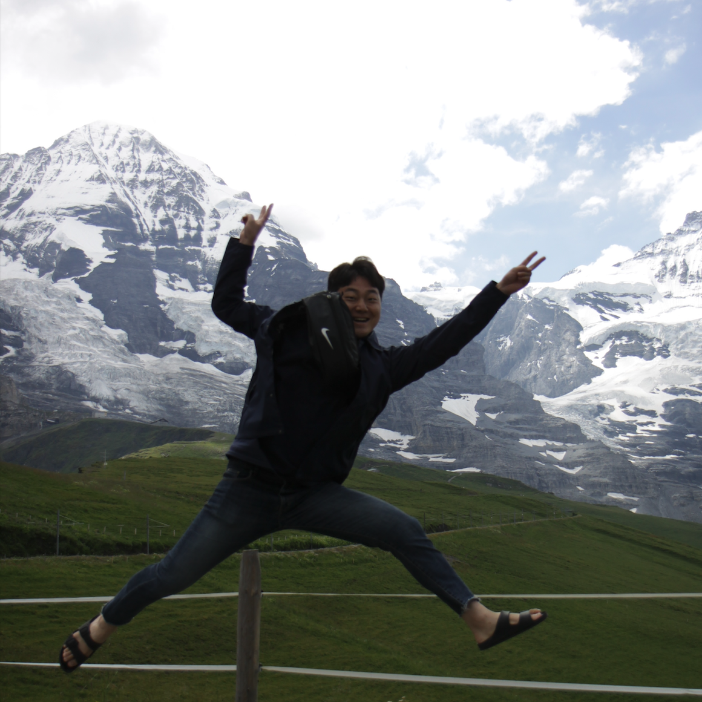

::: {.grid}

::: {.g-col-12 .g-col-md-4}
{width=80% style="border-radius: 50%; border: 3px solid #00205B; margin: auto; display: block;"}
:::

::: {.g-col-12 .g-col-md-8}
# Dongwook Kim

**PhD Student** | Civil & Environmental Engineering | Rice University

::: {.callout-note appearance="minimal" icon=false .lab-callout}
## **Explore My Research Affiliations**
To learn more about my *research groups, ongoing projects, and publications*, please visit the websites below.

::: {.d-flex .gap-2 .flex-wrap}
[**Doss-Gollin Research Group**](https://dossgollin-lab.github.io){.btn .btn-primary role="button"}
[**Gori Research Group**](https://gori.blogs.rice.edu){.btn .btn-primary role="button"}
:::
:::

::: {.panel-tabset}

## **Bio**

Dongwook Kim is a PhD student majoring in *Environmental Engineering* in the [Department of Civil and Environmental Engineering](https://cee.rice.edu/) at [Rice University](https://www.rice.edu/). 
His research focuses on hydrology and water systems, with an emphasis on understanding, predicting, and mitigating hydroclimate extremes such as floods, heavy rainfall, and tropical cyclones. 
He leverages probabilistic methods, machine learning, and remote sensing to advance flood hazard prediction and mapping capabilities. 
Before joining Rice, Dongwook worked for a private research institute specializing in water resources and disaster research, fulfilling his mandatory military service as a technical research personnel for three years. 
He earned his MS from [Hanyang University](https://www.hanyang.ac.kr/web/eng) and his BS from [Hanyang University ERICA](https://www.hanyang.ac.kr/web/eng/erica-campus1).

<!-- ### Longer Bio

I grew up in New Haven, CT, surrounded by the challenges and possibilities of aging urban infrastructure.
My interests in renewable energy motivated me to study mechanical engineering at Yale, but projects with [EWB-Yale](https://ewb.sites.yale.edu/projects/roh-cameroon), [Fundación Paraguaya](https://www.fundacionparaguaya.org.py/), and [UFC Pós-DEHA](https://www.posdeha.ufc.br/) on rural water security sparked my interest in climate risk and infrastructure resilience.

I earned my MS and PhD at Columbia as part of the [Columbia Water Center](https://water.columbia.edu/), advised by [Upmanu Lall](https://www.columbia.edu/~ula2/), building data-driven models of rainfall and climate hazards.
As a postdoc at Penn State's [Earth and Environmental Systems Institute](https://www.eesi.psu.edu/) with [Klaus Keller](https://keller-lab.github.io/), I worked on decision-support tools for communities managing flood risks.

I joined Rice in 2021.
Houston is a wonderful testbed for this work — massive port, rapid sea level rise, sprawling city, strained grid, chronic flooding.
My group uses AI and statistics to better understand climate risks, particularly flooding and rainfall, and to inform adaptation decisions.
At Rice, I lead the [Cluster for AI for Climate Risk and Urban Resilience](https://ai4urbanresilience.rice.edu/) at the Ken Kennedy Institute and am affiliated with the [SSPEED Center](https://sspeed.rice.edu/) and the [Consortium for Enhancing Resilience and Catastrophe Modeling (CERCat)](https://www.catmodeling.org/).
I teach courses on [climate risk management](https://ceve-421-521.github.io/) and [data science for hydroclimate hazard assessment](https://ceve543.github.io/).

I'm a proud alum of [Wilbur Cross](https://wilburcross.nhps.net/) and a [New Haven Promise](https://newhavenpromise.org/) scholar, and will staunchly defend the superiority of *apizza*.
Outside of work, I enjoy playing and watching soccer (*Forza Roma! Dale Albirroja!*) and exploring Houston's food and playgrounds with my family.

## Español

**¡Hola!**
Soy profesor asistente en el [Departamento de Ingeniería Civil y Ambiental](https://cee.rice.edu/) de Rice University.

Crecí en New Haven, CT, rodeado de los desafíos y las posibilidades de una infraestructura urbana envejecida.
Mi interés en las energías renovables me motivó a estudiar ingeniería mecánica en Yale, pero proyectos con [EWB-Yale](https://ewb.sites.yale.edu/projects/roh-cameroon), [Fundación Paraguaya](https://www.fundacionparaguaya.org.py/) y [UFC Pós-DEHA](https://www.posdeha.ufc.br/) sobre seguridad hídrica rural despertaron mi interés en el riesgo climático y la resiliencia de infraestructura.

Obtuve mi maestría y doctorado en Columbia como parte del [Columbia Water Center](https://water.columbia.edu/), bajo la dirección de [Upmanu Lall](https://www.columbia.edu/~ula2/), modelando la precipitación y los riesgos climáticos.
Como postdoc en el [Earth and Environmental Systems Institute](https://www.eesi.psu.edu/) de Penn State con [Klaus Keller](https://keller-lab.github.io/), trabajé con comunidades que gestionan riesgos de inundación.

Me incorporé a Rice en 2021.
Houston es un laboratorio fascinante para este trabajo: puerto enorme, aumento rápido del nivel del mar, ciudad en expansión, red eléctrica bajo presión, inundaciones crónicas.
Mi grupo utiliza IA y estadística para comprender mejor los riesgos climáticos, particularmente las inundaciones y la precipitación, e informar decisiones de adaptación.
En Rice, lidero el [Cluster de IA para Riesgo Climático y Resiliencia Urbana](https://ai4urbanresilience.rice.edu/) en el Ken Kennedy Institute y estoy afiliado al [Centro SSPEED](https://sspeed.rice.edu/) y al [Consorcio para Mejorar la Resiliencia y Modelado de Catástrofes (CERCat)](https://www.catmodeling.org/).
Imparto cursos sobre [gestión del riesgo climático](https://ceve-421-521.github.io/) y [ciencia de datos para la evaluación de riesgos hidroclimáticos](https://ceve543.github.io/).

Soy un orgulloso exalumno de [Wilbur Cross](https://wilburcross.nhps.net/) y becario de [New Haven Promise](https://newhavenpromise.org/), y defenderé firmemente la superioridad de la *apizza*.
Fuera del trabajo, disfruto jugar y ver fútbol (*¡Forza Roma! ¡Dale Albirroja!*) y explorar la gastronomía y los parques de Houston con mi familia. -->

:::

:::
:::
